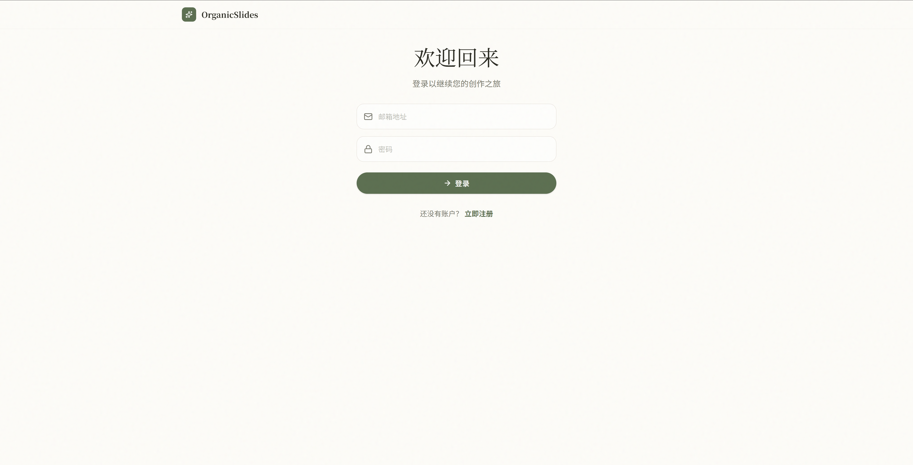

# 🌿 OrganicSlides - AI 智能演示文稿生成系统

<div align="center">

**基于多智能体协作的智能 PPT 生成平台**

[](https://python.org)
[](https://fastapi.tiangolo.com)
[](https://react.dev)
[](https://docker.com)

</div>

---

## 📖 项目简介

OrganicSlides 是一个基于 **LangGraph 多智能体架构** 的 AI 演示文稿生成系统。用户只需输入主题描述，系统会自动进行研究、策划、撰写、设计和渲染，生成专业级的 PowerPoint 演示文稿。

### ✨ 核心特性

- 🤖 **多智能体协作** - 5 个专业 AI Agent 分工协作
- 🔄 **人机回环 (HITL)** - 用户可审核和修改 AI 生成的大纲
- 🎨 **24 种视觉风格** - 18 个 Tier 1/2/3 + 6 个 Professional Editorial
- 🎯 **双路径渲染** - Path A (可编辑 HTML) 和 Path B (全 AI 视觉) 自由选择
- 🖼️ **AI 图像生成** - 集成 Google Gemini 3 Pro 自动生成演讲配图
- 📊 **原生 PPTX** - 直接生成可编辑的 PowerPoint 文件
- 🔐 **用户认证** - JWT 安全认证系统
- ⚙️ **服务拆分** - API 网关与 Worker 执行器分离运行
- 🐳 **Docker 部署** - 一键启动完整服务

---

## 🖼️ 界面预览

### 登录页面
采用温暖的米色调和自然主义设计，打造舒适的创作环境。



### 创作主页
输入您的演示主题，AI 智能体将为您完成从研究到渲染的全流程工作。


---

## 🏗️ 系统架构

```
┌──────────────────────────────────────────────────────────────┐
│                     用户界面 (React)                          │
├──────────────────────────────────────────────────────────────┤
│                  FastAPI API Gateway                        │
├──────────────────────────────────────────────────────────────┤
│               Dedicated Worker Service (FastAPI)            │
├──────────────────────────────────────────────────────────────┤
│ ┌─────────────────────────────────────────────────────────┐  │
│ │           LangGraph 多智能体编排引擎                      │  │
│ └─────────────────────────────────────────────────────────┘  │
├──────────┬──────────┬──────────┬──────────┬────────────────┤
│ 研究员    │ 策划师   │ 撰稿人   │ 视觉总监  │ 渲染引擎        │
│ Researcher│ Planner │ Writer  │ Visual   │ Renderer       │
└──────────┴──────────┴──────────┴──────────┴────────────────┘
                              │
        ┌─────────────────────┼─────────────────────┐
        │                     │                     │
    Path A              Path B (AI)          Editorial
  (HTML渲染)          (Gemini生成)         (纯排版)
        │                     │                     │
    html2pptx.js       generate_image.py    Pentagram
  Playwright          + create_slides.py    NYT Mag
    sharp                    │                  ...
        │                     │                     │
        └─────────────────────┼─────────────────────┘
                              │
                        PowerPoint
                        ┌────────┐
                        │ PPTX   │
                        └────────┘

           PostgreSQL (state/jobs/events) + Redis (optional cache)
```

### huashu-slides 集成

```
huashu-slides/
├── scripts/
│   ├── generate_image.py      ← Gemini API 图像生成
│   ├── html2pptx.js           ← HTML 转 PPTX
│   └── create_slides.py       ← 图像序列转 PPTX
├── assets/style-samples/      ← 24 种风格样例
└── references/                ← 风格指南文档

backend/services/
└── script_wrappers/           ← Python 包装模块
    ├── image_gen.py           ← generate_image() 函数
    ├── html_converter.py      ← html_to_pptx_slide() 函数
    └── slide_creator.py       ← create_pptx_from_images() 函数
```

### 智能体职责

| 智能体 | 职责 | 核心能力 |
|-------|------|---------|
| 🔬 **Researcher** | 素材收集 | RAG 检索、联网搜索 |
| 📋 **Planner** | 大纲策划 | 意图分析、结构设计 |
| ✍️ **Writer** | 内容撰写 | 文案生成、演讲备注 |
| 🎨 **Visual** | 视觉设计 | 布局决策、配色方案 |
| 🖨️ **Renderer** | 文件渲染 | python-pptx 生成 |

---

## 🛠️ 技术栈

### 后端
- **框架**: FastAPI + Uvicorn
- **服务拓扑**: API Gateway + Worker Service
- **AI 编排**: LangGraph + LangChain
- **大模型**: OpenAI GPT-4o (内容) + Google Gemini 3 Pro Image (图像)
- **演讲文稿**: huashu-slides (24 种风格 + 双路径渲染)
  - **Path A**: Playwright + html2pptx.js (HTML→PPTX)
  - **Path B**: Gemini API + python-pptx (AI 图像→PPTX)
  - **Editorial**: Pentagram、NYT Magazine 等专业排版
- **数据库**: PostgreSQL (工作流状态、项目、任务、事件) + Redis (可选缓存)
- **认证**: JWT + bcrypt

### 前端
- **框架**: React 19 + TypeScript
- **构建工具**: Vite 7
- **样式**: Tailwind CSS 4
- **图标**: Lucide React

### 演讲风格库 (huashu-slides)
- **18 Tier 1/2/3 风格**: Snoopy、Neo-Pop、敦煌壁画、xkcd、Neo-Brutalism 等
- **6 Professional Editorial**: NYT Magazine、Pentagram、Müller-Brockmann 等
- **样式配置**: 24 个 JSON 配置 + 17 张 PNG 样例
- **完整文档**: 设置指南、用户指南、风格选择指南

---

## 🚀 快速开始

### 环境要求

- Docker & Docker Compose
- OpenAI API Key

### 1. 克隆项目

```bash
git clone https://github.com/your-username/OrganicSlides.git
cd OrganicSlides
```

### 2. 配置环境变量

```bash
cp .env.example .env
```

编辑 `.env` 文件，填入您的配置：

```env
# OpenAI API Key (必填，用于内容生成)
OPENAI_API_KEY=sk-your-openai-key

# Google Gemini API Key (选填，用于 Path B 图像生成)
GEMINI_API_KEY=sk-your-gemini-key

# JWT 密钥 (生产环境请修改)
JWT_SECRET_KEY=your-super-secret-key

# huashu-slides 脚本目录
SKILL_SCRIPTS_DIR=./huashu-slides/scripts/

# 样例风格目录
STYLE_SAMPLES_DIR=./huashu-slides/assets/style-samples/

# 默认渲染路径 ("auto" | "path_a" | "path_b")
RENDER_PATH_DEFAULT=auto

# API 调度 Worker 的内部地址
WORKER_BASE_URL=http://127.0.0.1:8001
```

### 3. 启动服务

```bash
docker-compose up --build
```

这会同时启动：

- `frontend` React 前端
- `backend` FastAPI API 网关
- `worker` FastAPI Worker 执行服务
- `postgres` 持久化数据库
- `redis` 可选缓存/协调组件

### 4. 访问应用

- **前端界面**: http://localhost:5173
- **API 文档**: http://localhost:8000/docs
- **Worker 健康检查**: http://localhost:8001/

---

## 📁 项目结构

```
OrganicSlides/
├── backend/                    # 后端服务
│   ├── agents/                 # 多智能体集群
│   │   ├── planner/           # 策划智能体
│   │   ├── researcher/        # 研究智能体
│   │   ├── writer/            # 撰写智能体
│   │   ├── visual/            # 视觉智能体
│   │   └── renderer/          # 渲染智能体
│   ├── services/
│   │   └── script_wrappers/   # huashu-slides 包装模块
│   │       ├── image_gen.py
│   │       ├── html_converter.py
│   │       └── slide_creator.py
│   ├── static/styles/         # 风格配置和样例
│   │   ├── 01-snoopy.json ... 18-neo-brutalism.json
│   │   ├── p1-pentagram.json ... p6-nyt-magazine.json
│   │   ├── index.json
│   │   └── samples/           # 17 张 PNG 样例
│   ├── auth/                   # 认证模块
│   ├── database/               # 数据库层
│   ├── main.py                 # API Gateway 入口
│   ├── worker_app.py           # Worker 服务入口
│   ├── worker_runtime.py       # Worker 工作流执行器
│   ├── worker_client.py        # API -> Worker 调度客户端
│   ├── event_stream.py         # 基于持久化事件的 SSE 转发
│   ├── app_lifecycle.py        # API/Worker 共享生命周期
│   ├── graph.py                # LangGraph 工作流
│   └── requirements.txt        # Python 依赖
├── frontend/                   # 前端应用
│   ├── src/
│   │   ├── components/        # UI 组件
│   │   ├── views/             # 页面视图
│   │   ├── api/               # API 客户端
│   │   └── App.tsx            # 应用入口
│   └── package.json           # Node 依赖
├── huashu-slides/             # AI 演讲文稿库
│   ├── scripts/               # 核心脚本
│   │   ├── generate_image.py  # Gemini API 图像生成
│   │   ├── html2pptx.js       # HTML 转 PPTX
│   │   └── create_slides.py   # 图像序列转 PPTX
│   ├── assets/
│   │   └── style-samples/     # 24 种风格样例
│   └── references/            # 风格指南
├── docs/                       # 用户文档
│   ├── user-guide.md          # 完整用户指南
│   ├── style-selection-guide.md # 风格选择指南
│   └── setup-huashu-deps.md   # 依赖安装指南
├── docker-compose.yml          # Docker 编排
└── .env.example               # 环境变量模板
```

---

## 🔧 开发指南

### 本地开发（不使用 Docker）

#### 后端

```bash
cd backend
pip install -r requirements.txt
uvicorn main:app --reload
```

单独启动 Worker：

```bash
cd backend
pip install -r requirements.txt
uvicorn worker_app:app --port 8001 --reload
```

#### 前端

```bash
cd frontend
npm install
npm run dev
```

---

## 📄 API 接口

### 认证

| 方法 | 端点 | 描述 |
|-----|------|------|
| POST | `/api/v1/auth/register` | 用户注册 |
| POST | `/api/v1/auth/login` | 用户登录 |
| GET | `/api/v1/auth/me` | 获取当前用户 |

### 项目

| 方法 | 端点 | 描述 |
|-----|------|------|
| POST | `/api/v1/project/create` | 创建项目 |
| GET | `/api/v1/workflow/start/{id}` | 启动工作流 (SSE) |
| GET | `/api/v1/workflow/resume/{id}` | 恢复工作流 (SSE) |
| GET | `/api/v1/project/download/{id}` | 下载 PPTX |

### 风格管理（新增）

| 方法 | 端点 | 描述 |
|-----|------|------|
| GET | `/api/v1/styles/list` | 获取所有风格 |
| GET | `/api/v1/styles/{id}` | 获取风格详情 |
| GET | `/api/v1/styles/samples/{id}` | 获取风格样例图 |
| POST | `/api/v1/render/image` | 生成 AI 图像 |
| POST | `/api/v1/render/pptx` | 创建 PPTX |

---

## 🤝 贡献

欢迎提交 Issue 和 Pull Request！

---

## 📜 许可证

MIT License

---

<div align="center">

**用 AI 种下一颗思想的种子 🌱**

</div> 
